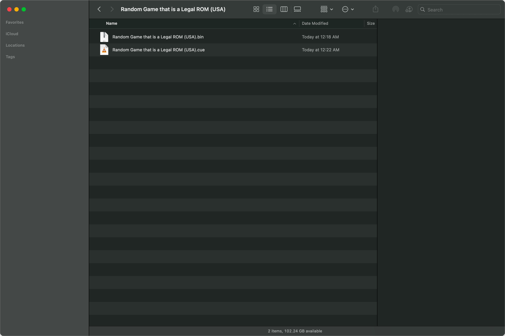
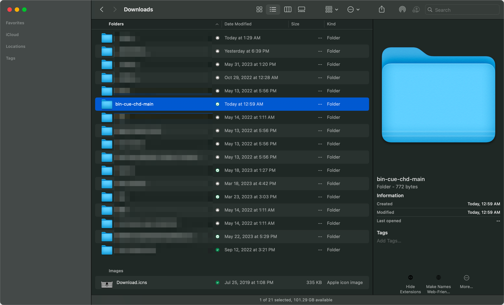
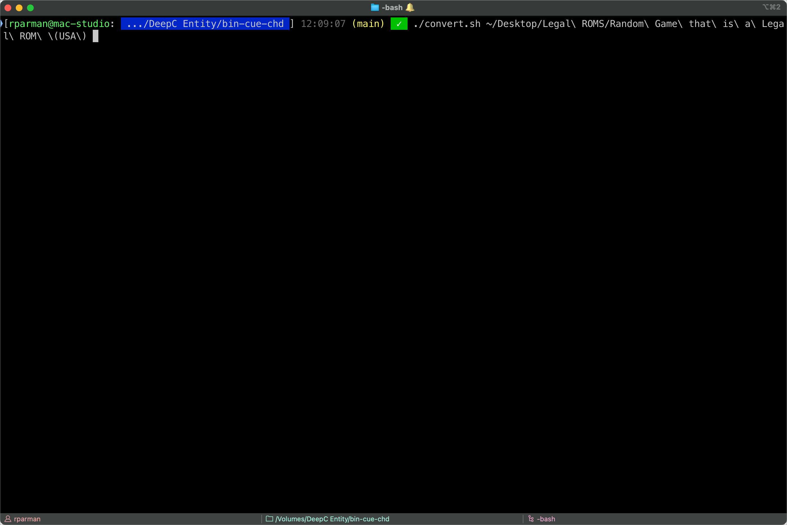
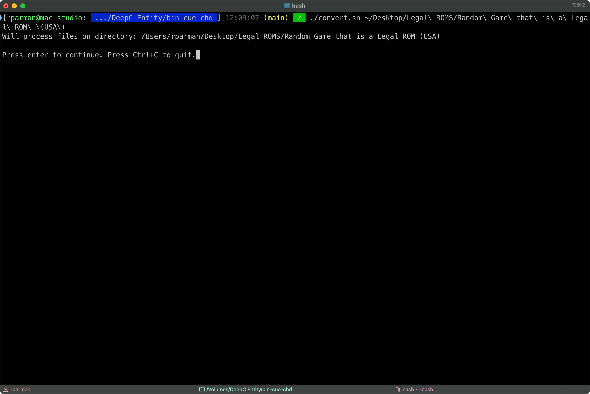
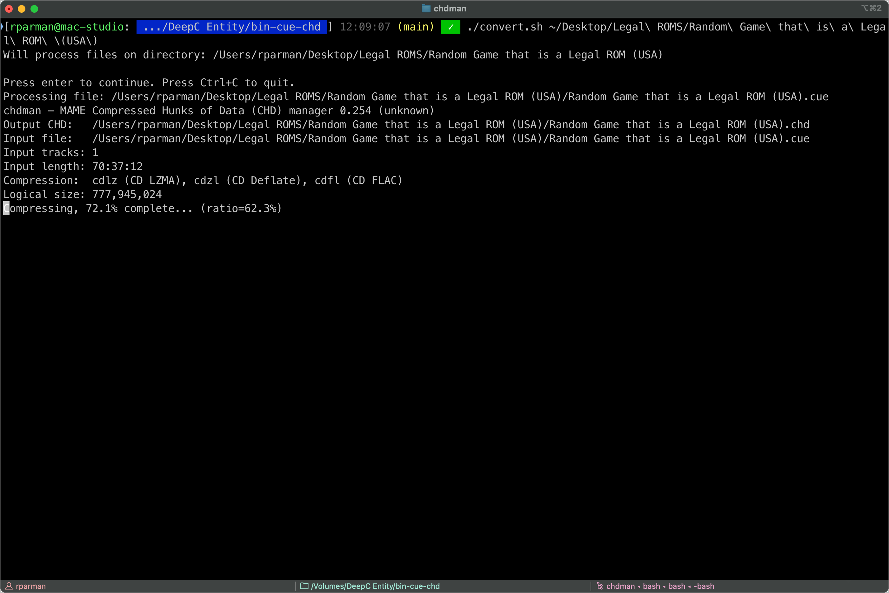
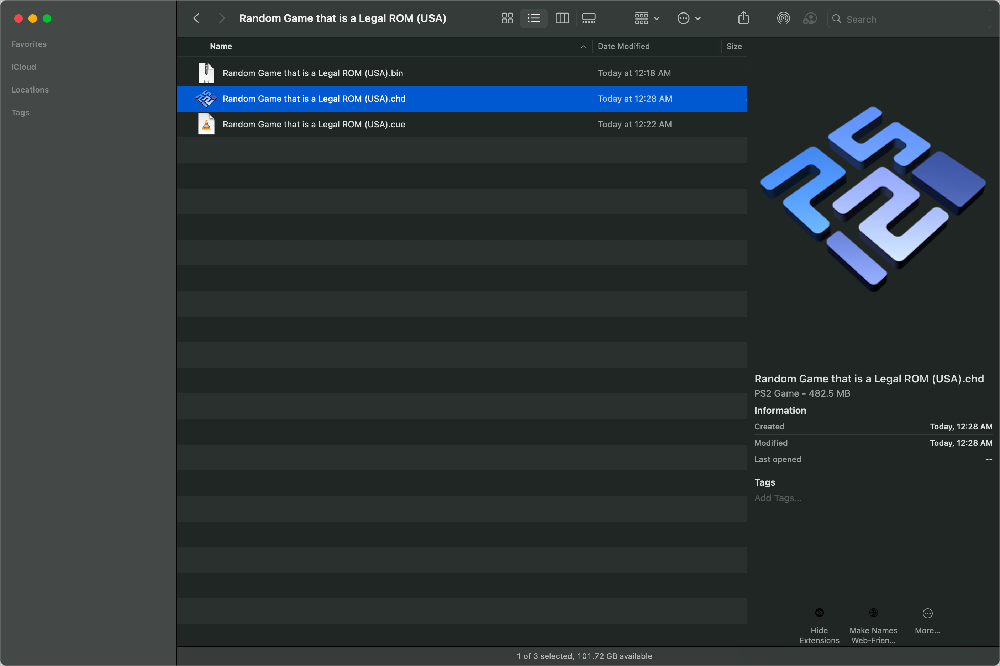
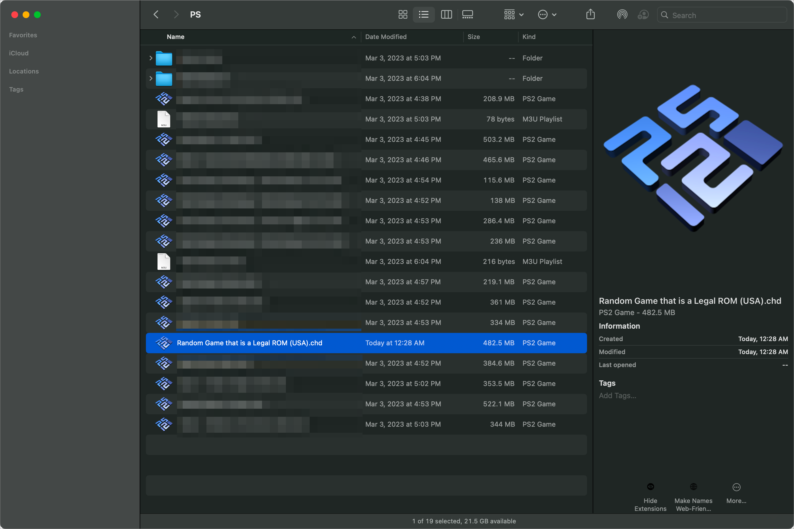

# Converting your completely legal, disc-based, bin/cue ROMs for PlayStation emulation into compressed, single-file CHDs using macOS

A member of the PlayStation homebrew community has developed a game for users of PSX emulators to enjoy, released under a permissive software license which allows sharing and re-use. After downloading the completely legal ROM of the game, you notice that the game is provided as a `*.bin` and `*.cue` file. These instructions will show you how to combine and compress these files into a new `*.chd` file which saves you hundreds of megabytes of drive space, and is a single file that is easier to share and load into your preferred PSX emulator.

Each step is explained in English with the corresponding terminal command below it. These instructions should work without problem on any modern macOS — with either Intel or Apple Silicon CPUs. Tested on macOS Ventura 13.5 on both an Intel i9 chip, and an Apple M1 Max chip.

## Prerequisites

* A _relatively_ [recent version of macOS](https://gist.github.com/skyzyx/225b59847be31b39d3d19c3a1c006862).

    <div></div>

* Comfortable-enough using _Terminal.app_ (or alternatives).

    <div></div>

* An application which can open `.7z` archives. I can recommend:

    * [The Unarchiver](https://apps.apple.com/us/app/the-unarchiver/id425424353?mt=12) (free)
    * [Archiver](https://archiverapp.com) (paid)

* You have [Homebrew](https://brew.sh) installed. ([Installation](https://mac.install.guide/homebrew/index.html) is outside the scope of this tutorial, but it’s pretty fundamental if you do technical things on your Mac.)

    * This includes installing the [Xcode CLI tools](https://mac.install.guide/homebrew/2.html) (a much smaller download than the _entire_ Xcode).

## Decompressing the file

1. After downloading the game from the homebrew developer's website, you find that the game is compressed as a `.7z` file.

1. Decompress the `.7z` file.

    1. Select the file(s).

    1. _Right-click_ with a mouse; _two-finger tap_ on a trackpad; or _control-click_ with the keyboard — and then choose _Open_ from the menu.

        (Or if you prefer the keyboard, type _command-down_ (`⌘ ↓`) to open files.)

        

## Downloading and preparing to run a shell script, for the _nearly-absolute beginner_

> **NOTE:** If you are comfortable with Git, GitHub, and Terminal — you just need to `git clone` (or download) the repository, then run the `./convert.sh` shell script passing the **directory** where the `.bin`/`.cue` files live as the argument. The rest of these instructions are for everyone else.

1. [Download a .zip file containing the source code](https://github.com/skyzyx/bin-cue-chd/archive/refs/heads/main.zip) from the [`skyzyx/bin-cue-chd`](https://github.com/skyzyx/bin-cue-chd) GitHub repository. By default, it will save to your `Downloads` folder.

1. Inside your `Downloads` folder, find `bin-cue-chd-main.zip` and double-click it to decompress it into a folder called `bin-cue-chd-main`.

    

1. Using Spotlight (by default, command-spacebar — `⌘[space]`), search for _Terminal_. When there is a matching result, press enter/return.

1. In Terminal, type `cd` followed by the spacebar.

1. Using your mouse/trackpad, click-and-drag the `bin-cue-chd-main` folder from Finder into your Terminal window. You'll notice that the path of the folder got filled-in _after_ the `cd `.

1. Press enter/return. You are now inside the `bin-cue-chd-main` folder in your Terminal app.

1. Install `findutils` and `rom-tools` using Homebrew.

    ```bash
    brew install findutils rom-tools
    ```

## Running a shell script, for the _nearly-absolute beginner_

You're stiil in the Terminal app, and still inside the `bin-cue-chd-main` folder. Right?

> **NOTE:** To check, type `pwd` and press enter/return. You should see a path that ends with `bin-cue-chd-main`.

1. Type the following (beginning with a _period-slash_), followed by a space.

    ```bash
    ./convert.sh
    ```

1. Find the Finder window that shows the folder where your `.bin`/`.cue` ROM is.

1. Just like before — using your mouse/trackpad, click-and-drag the ROM folder from Finder into your Terminal window. You'll notice that the path of the folder got filled-in _after_ the `./convert.sh `.

    ```bash
    ./convert.sh /example/path/to/your/game/folder
    ```

    

1. Press enter/return to begin the conversion.

## Converting to a `.chd` file

1. You'll see something _similar_ to:

    ```plain
    Will process files on directory: /Users/rparman/Desktop/Legal ROMS/Random Game that is a Legal ROM (USA)

    Press enter to continue. Press Ctrl+C to quit.
    ```

    

    Press enter/return.

1. The files will begin processing, and look _similar_ to:

    ```plain
    Processing file: /Users/rparman/Desktop/Legal ROMS/Random Game that is a Legal ROM (USA)/Random Game that is a Legal ROM (USA).cue
    chdman - MAME Compressed Hunks of Data (CHD) manager 0.254 (unknown)
    Output CHD: /Users/rparman/Desktop/Legal ROMS/Random Game that is a Legal ROM (USA)/Random Game that is a Legal ROM (USA).chd
    Input file: /Users/rparman/Desktop/Legal ROMS/Random Game that is a Legal ROM (USA)/Random Game that is a Legal ROM (USA).cue
    Input tracks: 1
    Input length: 70:37:12
    Compression: cdlz (CD LZMA), cdzl (CD Deflate), cdfl (CD FLAC)
    Logical size: 777,945,024
    Compressing, 72.1% complete... (ratio=62.3%)
    ```

    

1. When it's done, you'll have a new `.chd` file in the same folder as the `.bin`/`.cue` files. The `.chd` is a _replacement_ for the `.bin`/`.cue` files.

    It is now _one file_ that contains your game, and uses less space on-disk.

    

1. When you're ready, you can copy it to the location where you keep/play your other legal ROMs.

    
