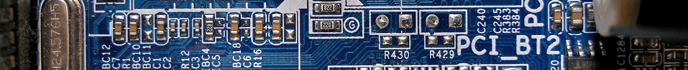
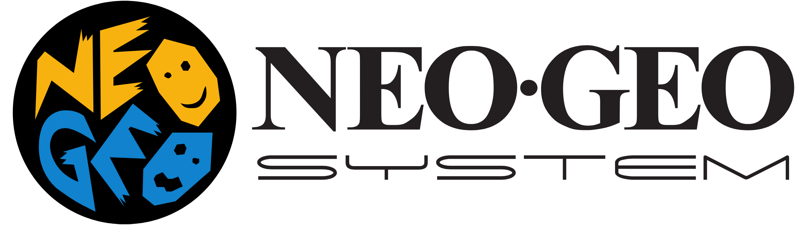
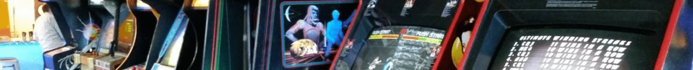
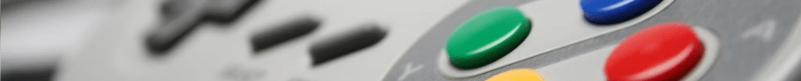
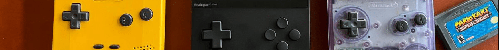
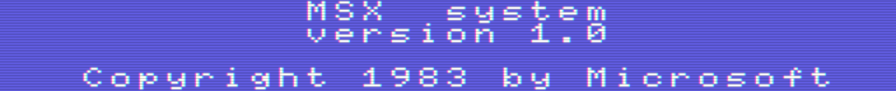

# Finding and adding the correct BIOS files to Garlic OS on the Anbernic RG35XX so that you can play ROMs

Each step is explained in English with the corresponding terminal command below it. These instructions should work without problem on any modern macOS — with either Intel or Apple Silicon CPUs. Tested on macOS Ventura 13.5 on both an Intel i9 chip, and an Apple M1 Max chip.

## Prerequisites

* A _relatively_ [recent version of macOS](https://gist.github.com/skyzyx/225b59847be31b39d3d19c3a1c006862).

    <div></div>

* Comfortable-enough using _Terminal.app_ (or alternatives).

    <div></div>

* You have [Homebrew](https://brew.sh) installed. ([Installation](https://mac.install.guide/homebrew/index.html) is outside the scope of this tutorial, but it’s pretty fundamental if you do technical things on your Mac.)

    * This includes installing the [Xcode CLI tools](https://mac.install.guide/homebrew/2.html) (a much smaller download than the _entire_ Xcode).

## BIOS files for the RG35XX



Garlic OS shares certain fundamentals with Onion OS. Namely, these include names of ROM folders, and the BIOS files that are necessary to play games. The canonical guide for Onion OS lives at <https://github.com/OnionUI/Onion/wiki/Emulators>, and it is **extremely good**. However, Garlic OS and Onion OS are not _identical_, and in some cases, they do things slightly differently.

This document was created by cross-referencing [Onion UI: Emulators](https://github.com/OnionUI/Onion/wiki/Emulators), [Libretro: Core List](https://docs.libretro.com/meta/core-list/), and [GitHub: @libretro](https://github.com/libretro).

These BIOS files also generally work well with other emulators (like [OpenEmu]), although the focus here is on the RG35XX device.

### Preparation

If you followed one of the _Installing Garlic OS on your Anbernic RG35XX using macOS_ guides to do an initial installation of Garlic OS, you’ll remember that we had a volume called `MISC` and another called `ROMS`.

1. In the `ROMS` volume, you should have (at least) these folders: `BIOS`, `CFW`, `Roms`, `Saves`, and `Screenshots`.

1. Inside the `ROMS/BIOS` folder, this is where you will put all of the BIOS files (listed below).

1. The ROM folders are mapped back to a specific emulator core by opening the `ROMS` SD card partition, going into the `CFW` → `config` folder, and opening `coremapping.json` in your preferred editor.

    <details>
    <summary>See the Terminal command…</summary>

    Open the Finder window:

    ```bash
    open /Volumes/ROMS/CFW/config/
    ```

    Then double-click `coremapping.json` to open the file with whichever application is configured to open JSON files. (If you don’t have a preferred code editor, I can suggest [VS Code].)

    Alternatively…

    ```bash
    open /Volumes/ROMS/CFW/config/coremapping.json
    ```

    </details>

### Note about save files

<details>
<summary>TLDR</summary>

Save files are _emulator-specific_. The (default) emulator that is assigned to a ROM folder will create save files in that emulator’s format (which is why I’m mentioning this here).

If you want to "cross-save" with a different device, you need to ensure you’re using the same emulator on the other device.

This is not bulletproof, however. Different systems may use different versions/commits of these emulators, which may be incompatible with each other. So make sure you regularly backup your save files.

</details>

### Special instructions for SNK Neo Geo Systems

<details>
<summary>TLDR</summary>

<div></div>

This applies to **Neo Geo arcade games**, **Neo Geo console games**, **Neo Geo CD games**. Sometimes the Neo Geo emulator looks for BIOS files in the same directory as the game, and sometimes it looks in the `BIOS/` directory.

1. Inside the `ROMS/Roms` folder, create a new subfolder called `NEOGEO` if it doesn’t already exist.

    1. **Copy** (not move) `ROMS/BIOS/neogeo.zip` to `ROMS/Roms/NEOGEO/neogeo.zip`.

        <details>
        <summary>See the Terminal command…</summary>

        ```bash
        cp --verbose --force /Volumes/ROMS/BIOS/neogeo.zip /Volumes/ROMS/Roms/NEOGEO/neogeo.zip
        ```

        </details>

1. Inside the `ROMS/Roms` folder, create a new subfolder called `NEOCD` if it doesn’t already exist.

    1. **Copy** (not move) `ROMS/BIOS/neogeo.zip` to `ROMS/Roms/NEOCD/neogeo.zip`.

        <details>
        <summary>See the Terminal command…</summary>

        ```bash
        cp --verbose --force /Volumes/ROMS/BIOS/neogeo.zip /Volumes/ROMS/Roms/NEOCD/neogeo.zip
        ```

        </details>

Yes, this means that there will be multiple copies of `neogeo.zip`on your SD card. No, don’t create symlinks.

</details>

## Arcade Systems



While you can certainly do some fiddling if you are a true _arcade aficionado_, for most people we’re going to recommend _FinalBurn Neo_ for playing arcade games. It seems to work more consistently than MAME, CPS, or the other options.

Inside the `ROMS/Roms` folder, create a new subfolder called `FBNEO` if it doesn’t already exist. This is where you will put all of the Arcade ROMs.

> **NOTE:** You can validate MD5 checksums using [Appendix: BIOS Checksums].

<details>
<summary>Finalburn Neo not doing it for you?</summary>

Garlic OS and RetroArch will try to execute games inside the `FBNEO` folder with the _Finalburn Neo_ arcade emulator. This is _probably OK_, but if you have an arcade game that doesn’t work well with _Finalburn Neo_, there are some alternatives.

| Folder     | Emulator                 |
|------------|--------------------------|
| `ARCADE`   | [MAME 2003 Plus]         |
| `FBA2012`  | [Finalburn Alpha (2012)] |
| `FBNEO`    | [Finalburn Neo]          |
| `MAME2000` | [MAME 2000]              |

While RetroArch (`libretro`) supports other Arcade emulators, Garlic OS on the RG35XX does not.

</details>

| Game system                                | BIOS filenames  |
|--------------------------------------------|-----------------|
| Bubble System BIOS                         | `bubsys.zip`    |
| C-Chip Internal ROM                        | `cchip.zip`     |
| Fairchild Channel F BIOS                   | `channelf.zip`  |
| Nebula (Deco Cassette) (BIOS)              | `cnebula.zip`   |
| ColecoVision System BIOS                   | `coleco.zip`    |
| DECO Cassette System BIOS                  | `decocass.zip`  |
| FDS System BIOS                            | `fdsbios.zip`   |
| ISG Selection Master Type 2006 System BIOS | `isgsm.zip`     |
| Midway SSIO Sound Board Internal ROM       | `midssio.zip`   |
| MSX1 System BIOS                           | `msx.zip`       |
| Namco C69 BIOS                             | `namcoc69.zip`  |
| Namco C70 BIOS                             | `namcoc70.zip`  |
| Namco C75 BIOS                             | `namcoc75.zip`  |
| Neo Geo CDZ System BIOS                    | `neocdz.zip`    |
| Neo Geo BIOS                               | `neogeo.zip`    |
| Neo Geo Pocket BIOS                        | `ngp.zip`       |
| NMK004 Internal ROM                        | `nmk004.zip`    |
| PGM System BIOS                            | `pgm.zip`       |
| Super Kaneko Nova System BIOS              | `skns.zip`      |
| ZX Spectrum 128 BIOS                       | `spec128.zip`   |
| ZX Spectrum 128 +2a BIOS                   | `spec1282a.zip` |
| ZX Spectrum BIOS                           | `spectrum.zip`  |
| YM2608 Internal ROM                        | `ym2608.zip`    |

Source: <https://docs.libretro.com/library/fbneo/>

## Consoles and PC Systems



If the game system has a flag next to it, it means that the name/device was only sold in that market.

> **NOTE:** You can validate MD5 checksums using [Appendix: BIOS Checksums].

| Game system                                             | Year | Core/Emulator                     | BIOS filenames                                                                                                                                                                                                                                                                                              | ROM folder name       |
|---------------------------------------------------------|------|-----------------------------------|-------------------------------------------------------------------------------------------------------------------------------------------------------------------------------------------------------------------------------------------------------------------------------------------------------------|-----------------------|
| 3DO Interactive Multiplayer¹                            | 1993 | [Opera]                           | `panafz1.bin` or `panafz10.bin` or `panafz10-norsa.bin` or `panafz10e-anvil.bin` or `panafz10e-anvil-norsa.bin` or `panafz1j.bin` or `panafz1j-norsa.bin` or `goldstar.bin` or `sanyotry.bin` or `3do_arcade_saot.bin`<br><br>(JP: `panafz1-kanji.bin`, `panafz10ja-anvil-kanji.bin`, `panafz1j-kanji.bin`) | `PANASONIC` ⚠️         |
| Amstrad CPC                                             | 1984 | [CrocoDS]                         | _None_                                                                                                                                                                                                                                                                                                      | `CPC`                 |
| Atari 800                                               | 1979 | [Atari800]                        | `ATARIOSA.ROM`, `ATARIOSB.ROM`, `ATARIBAS.ROM`                                                                                                                                                                                                                                                              | `EIGHTHUNDRED` ⚠️      |
| Atari 2600                                              | 1977 | [Stella 2014]                     | _None_                                                                                                                                                                                                                                                                                                      | `ATARI`               |
| Atari 5200 SuperSystem                                  | 1982 | [a5200]                           | `5200.rom`, `ATARIBAS.ROM`                                                                                                                                                                                                                                                                                  | `FIFTYTWOHUNDRED`     |
| Atari 7800 ProSystem                                    | 1986 | [ProSystem]                       | `7800 BIOS (U).rom`, `7800 BIOS (E).rom`                                                                                                                                                                                                                                                                    | `SEVENTYEIGHTHUNDRED` |
| Atari Falcon                                            | 1992 | [Hatari]                          | `tos.img` v4.x                                                                                                                                                                                                                                                                                              | `ATARIST` ⚠️           |
| Atari MEGA STE                                          | 1991 | [Hatari]                          | `tos.img` v1.x, 2.x                                                                                                                                                                                                                                                                                         | `ATARIST` ⚠️           |
| Atari ST                                                | 1985 | [Hatari]                          | `tos.img` v1.00, 1.02, 1.04, 2.06                                                                                                                                                                                                                                                                           | `ATARIST` ⚠️           |
| Atari TT                                                | 1990 | [Hatari]                          | `tos.img` v3.x                                                                                                                                                                                                                                                                                              | `ATARIST` ⚠️           |
| ColecoVision                                            | 1982 | [blueMSX]                         | `coleco.rom`                                                                                                                                                                                                                                                                                                | `COLECO`              |
| Commodore 64                                            | 1982 | [VICE] x64                        | _None_                                                                                                                                                                                                                                                                                                      | `COMMODORE`           |
| Commodore 128                                           | 1985 | [VICE] x128                       | _None_                                                                                                                                                                                                                                                                                                      | `C128`                |
| Commodore Amiga                                         | 1985 | [PUAE 2021]                       | `kick33180.A500`, `kick34005.A500`, `kick34005.CDTV`, `kick37175.A500`, `kick37350.A600`, `kick39106.A1200`, `kick39106.A4000`, `kick40060.CD32`, `kick40060.CD32.ext`, `kick40063.A600`, `kick40068.A1200`, `kick40068.A4000`                                                                              | `AMIGA`               |
| Commodore Amiga CD32                                    | 1993 | [PUAE 2021]                       | `kick33180.A500`, `kick34005.A500`, `kick40068.A1200`                                                                                                                                                                                                                                                       | `AMIGACD`             |
| Commodore PET                                           | 1977 | [VICE] xpet                       | _None_                                                                                                                                                                                                                                                                                                      | `PET`                 |
| Commodore Plus/4                                        | 1984 | [VICE] xplus4                     | _None_                                                                                                                                                                                                                                                                                                      | `PLUS4`               |
| Commodore VIC-20                                        | 1980 | [VICE] xvic                       | _None_                                                                                                                                                                                                                                                                                                      | `VIC20`               |
| Fairchild Channel F                                     | 1976 | [FreeChaF]                        | `sl31253.bin`, `sl31254.bin`, `sl90025.bin`                                                                                                                                                                                                                                                                 | `FAIRCHILD`           |
| GCE Vectrex                                             | 1982 | [vecx]                            | _None_                                                                                                                                                                                                                                                                                                      | `VECTREX`             |
| Magnavox Odyssey 2<br>🇺🇸                              | 1978 | [O2EM]                            | `o2rom.bin`                                                                                                                                                                                                                                                                                                 | `ODYSSEY`             |
| Mattel Intellivision                                    | 1979 | [FreeIntv]                        | `exec.bin`, `grom.bin`                                                                                                                                                                                                                                                                                      | `INTELLIVISION`       |
| Microsoft MS-DOS                                        | 1981 | [DOSBox-Pure]                     | _None_                                                                                                                                                                                                                                                                                                      | `DOS`                 |
| NEC PC Engine<br>🇯🇵 🇪🇺                              | 1987 | [Beetle PCE Fast]                 | _None_                                                                                                                                                                                                                                                                                                      | `PCE`                 |
| NEC PC Engine SuperGrafx<br>🇯🇵                        | 1989 | [Beetle SuperGrafx]               | `syscard3.pce`                                                                                                                                                                                                                                                                                              | `SGFX`                |
| NEC PC-8000 series                                      | 1979 | [QUASI88]                         | _None_                                                                                                                                                                                                                                                                                                      | `PCEIGHTYEIGHT` ⚠️     |
| NEC PC-8800 (PC-88) series                              | 1981 | [QUASI88]                         | _None_                                                                                                                                                                                                                                                                                                      | `PCEIGHTYEIGHT` ⚠️     |
| NEC PC-9800 (PC-98) series                              | 1982 | [Neko Project II Kai]             | `np2/font.bmp`, `np2/FONT.ROM`, `np2/bios.rom`, `np2/itf.rom`, `np2/sound.rom`                                                                                                                                                                                                                              | `PCNINETYEIGHT` ⚠️     |
| NEC PC-FX<br>🇯🇵                                       | 1994 | [Beetle PCFX]                     | `pcfx.rom`                                                                                                                                                                                                                                                                                                  | `PCFX` ⚠️              |
| NEC TurboGrafx-16<br>🇺🇸                               | 1989 | [Beetle PCE Fast]                 | _None_                                                                                                                                                                                                                                                                                                      | `PCE`                 |
| Nintendo Entertainment System (NES)<br>🇺🇸 🇪🇺        | 1985 | [FCEUmm]                          | _None_                                                                                                                                                                                                                                                                                                      | `FC`                  |
| Nintendo Entertainment System (NES)<br>🇺🇸 🇪🇺        | 1985 | [Nestopia UE]                     | _None_                                                                                                                                                                                                                                                                                                      | `NESTOPIA`            |
| Nintendo Family Computer (Famicom)<br>🇯🇵              | 1983 | [FCEUmm]                          | _None_                                                                                                                                                                                                                                                                                                      | `FC`                  |
| Nintendo Family Computer (Famicom)<br>🇯🇵              | 1983 | [Nestopia UE]                     | _None_                                                                                                                                                                                                                                                                                                      | `NESTOPIA`            |
| Nintendo Virtual Boy                                    | 1995 | [Beetle VB]                       | _None_                                                                                                                                                                                                                                                                                                      | `VB`                  |
| Philips Videopac+<br>🇯🇵 🇪🇺                          | 1978 | [O2EM]                            | `o2rom.bin`, `g7400.bin` (maybe `c52.bin`, `jopac.bin`)                                                                                                                                                                                                                                                     | `VIDEOPAC`            |
| Sega Genesis<br>🇺🇸                                    | 1989 | [PicoDrive]                       | `bios_MD.bin`                                                                                                                                                                                                                                                                                               | `MD`                  |
| Sega Mark III<br>🇯🇵                                   | 1985 | [PicoDrive]                       | `bios_E.sms`, `bios_U.sms`, `bios_J.sms`                                                                                                                                                                                                                                                                    | `MS`                  |
| Sega Master System<br>🇺🇸 🇪🇺                         | 1986 | [PicoDrive]                       | `bios_E.sms`, `bios_U.sms`, `bios_J.sms`                                                                                                                                                                                                                                                                    | `MS`                  |
| Sega Mega Drive<br>🇯🇵 🇪🇺                            | 1988 | [PicoDrive]                       | `bios_MD.bin`                                                                                                                                                                                                                                                                                               | `MD`                  |
| Sega SG-1000<br>🇯🇵                                    | 1983 | [Gearsystem]                      | _None_                                                                                                                                                                                                                                                                                                      | `SEGASGONE`           |
| Sharp X1<br>🇯🇵                                        | 1982 | [X Millennium]                    | `xmil/IPLROM.X1`, `xmil/IPLROM.X1T`                                                                                                                                                                                                                                                                         | `XONE` ⚠️              |
| Sharp X68000<br>🇯🇵                                    | 1987 | [PX68k]                           | `keropi/iplrom.dat`, `keropi/cgrom.dat`, `keropi/iplrom30.dat`, `keropi/iplromco.dat`, `keropi/iplromxv.dat`                                                                                                                                                                                                | `X68000` ⚠️            |
| Sinclair ZX Spectrum<br>🇪🇺                            | 1982 | [Fuse]                            | _None_                                                                                                                                                                                                                                                                                                      | `ZXS`                 |
| Sinclair ZX-81<br>🇪🇺                                  | 1981 | [EightyOne]                       | _None_                                                                                                                                                                                                                                                                                                      | `ZXEIGHTYONE`         |
| SNK Neo Geo                                             | 1990 | [Final Burn Alpha (2012) Neo Geo] | `neogeo.zip`                                                                                                                                                                                                                                                                                                | `NEOGEO`              |
| SNK Neo Geo CD                                          | 1994 | [NeoCD]                           | (`000-lo.lo` or `ng-lo.rom`) + (`neocd_f.rom` or `neocd.bin` or `uni-bioscd.rom`) + `neogeo.zip`                                                                                                                                                                                                            | `NEOCD`               |
| Sony Playstation                                        | 1995 | [PCSX ReARMed]                    | `PSXONPSP660.bin`, `scph101.bin`, `scph7001.bin`, `scph5501.bin`, `scph1001.bin`                                                                                                                                                                                                                            | `PS`                  |
| Super Famicom<br>🇯🇵                                   | 1990 | [Snes9x]                          | _None_                                                                                                                                                                                                                                                                                                      | `SFC`                 |
| Super Nintendo Entertainment System (SNES)<br>🇺🇸 🇪🇺 | 1991 | [Snes9x]                          | _None_                                                                                                                                                                                                                                                                                                      | `SFC`                 |
| Uzebox                                                  | 2008 | [Uzem]                            | _None_                                                                                                                                                                                                                                                                                                      | `UZEBOX` ⚠️            |

¹ 3DO was a set of specifications, with manufacturing licensed to Panasonic, GoldStar, Sanyo, Creative, and Samsung.

<details>
<summary>Unplayable systems</summary>
<br>

These systems are deemed _unplayable_ either because emulation is far too slow on RG35XX, or because the BIOS files are extraordinarily hard to find on the internet.

| Game system  | Core/Emulator    | BIOS filenames       | ROM folder name | Issue(s)                                      |
|--------------|------------------|----------------------|-----------------|-----------------------------------------------|
| Atari Jaguar | [Virtual Jaguar] | `virtualjaguar_bios` | `JAGUAR` ⚠️      | Poor performance; BIOS files cannot be found. |

</details>

## Handheld Systems



> **NOTE:** You can validate MD5 checksums using [Appendix: BIOS Checksums].

| Game system                            | Year | Core/Emulator       | BIOS filenames | ROM folder name |
|----------------------------------------|------|---------------------|----------------|-----------------|
| Atari Lynx                             | 1989 | [Handy]             | `lynxboot.img` | `LYNX`          |
| Bandai SwanCrystal 🇯🇵                | 2002 | [Beetle Wonderswan] | _None_         | `WS`            |
| Bandai WonderSwan 🇯🇵                 | 1999 | [Beetle Wonderswan] | _None_         | `WS`            |
| Bandai WonderSwan Color 🇯🇵           | 2000 | [Beetle Wonderswan] | _None_         | `WS`            |
| Cougar Boy 🇧🇷                        | 1993 | [SameDuck]          | _None_         | `MEGADUCK`      |
| Nintendo Game &amp; Watch              | 1980 | [GW]                | _None_         | `GW`            |
| Nintendo Game Boy                      | 1989 | [Gambatte]          | `gb_bios.bin`  | `GB`            |
| Nintendo Game Boy Advance              | 2001 | [gpSP]              | `gba_bios.bin` | `GPSP`          |
| Nintendo Game Boy Advance              | 2001 | [mGBA]              | `gba_bios.bin` | `GBA`           |
| Nintendo Game Boy Color                | 1998 | [Gambatte]          | `gbc_bios.bin` | `GBC`           |
| Nintendo Pokemon Mini                  | 2001 | [PokeMini]          | `bios.min`     | `POKE`          |
| QuickShot Supervision 🇬🇧             | 1992 | [Potator]           | _None_         | `SUPERVISION`   |
| Sega Game Gear                         | 1990 | [PicoDrive]         | `bios.gg`      | `GG`            |
| SNK Neo Geo Pocket                     | 1998 | [Beetle NGP]        | _None_         | `NGP`           |
| SNK Neo Geo Pocket Color               | 1999 | [Beetle NGP]        | _None_         | `NGP`           |
| Watara Supervision 🇺🇸 🇯🇵 🇪🇺      | 1992 | [Potator]           | _None_         | `SUPERVISION`   |
| Welback Holdings Mega Duck WG-108 🇪🇺 | 1993 | [SameDuck]          | _None_         | `MEGADUCK`      |

## Add-ons and Peripherals


If the game system has a flag next to it, it means that the name/device was only sold in that market.

> **NOTE:** You can validate MD5 checksums using [Appendix: BIOS Checksums].

| Game system                               | Year | Core/Emulator     | BIOS filenames                                    | ROM folder name |
|-------------------------------------------|------|-------------------|---------------------------------------------------|-----------------|
| Bandai SuFami Turbo 🇯🇵                  | 1996 | [Snes9x]          | `STBIOS.bin`                                      | `SUFAMI`        |
| NEC PC Engine CD-ROM² 🇯🇵 🇪🇺           | 1988 | [Beetle PCE Fast] | `syscard3.pce`                                    | `PCECD`         |
| NEC TurboGrafx-CD 🇺🇸                    | 1989 | [Beetle PCE Fast] | `syscard3.pce`                                    | `PCECD`         |
| Nintendo Family Computer Disk System 🇯🇵 | 1986 | [FCEUmm]          | `disksys.rom`                                     | `FDS`           |
| Nintendo Satellaview 🇯🇵                 | 1995 | [Snes9x]          | `BS-X.bin`                                        | `SATELLAVIEW`   |
| Nintendo Super Game Boy                   | 1994 | [mGBA]            | `sgb_bios.bin`                                    | `SGB`           |
| Nintendo Super Game Boy 2 🇯🇵            | 1998 | [mGBA]            | `sgb_bios.bin`                                    | `SGB`           |
| Sega CD 🇺🇸                              | 1992 | [PicoDrive]       | `bios_CD_U.bin`, `bios_CD_E.bin`, `bios_CD_J.bin` | `SEGACD`        |
| Sega Genesis 32X 🇺🇸                     | 1994 | [PicoDrive]       | _None_                                            | `THIRTYTWOX`    |
| Sega Mega Drive 32X 🇪🇺                  | 1994 | [PicoDrive]       | _None_                                            | `THIRTYTWOX`    |
| Sega Mega-CD 🇯🇵 🇪🇺                    | 1991 | [PicoDrive]       | `bios_CD_U.bin`, `bios_CD_E.bin`, `bios_CD_J.bin` | `SEGACD`        |
| Sega Super 32X 🇯🇵                       | 1994 | [PicoDrive]       | _None_                                            | `THIRTYTWOX`    |
| Sega Visual Memory System (VMS) 🇯🇵 🇪🇺 | 1998 | [VeMUlator]       | _None_                                            | `VMU` ⚠️         |
| Sega Visual Memory Unit (VMU) 🇺🇸        | 1999 | [VeMUlator]       | _None_                                            | `VMU` ⚠️         |

## Miscellaneous



| Game system                       | Year | Core/Emulator | BIOS filenames                                    | ROM folder name |
|-----------------------------------|------|---------------|---------------------------------------------------|-----------------|
| ASCII Corporation + Microsoft MSX | 1983 | [blueMSX]     | See [blueMSX from libretro] for more information. | `MSX`           |
| [Pico-8 Fantasy Console]          | 2015 | [fake-08]     | _None_                                            | `PICO`          |
| [ScummVM][scmvm]                  | 2001 | [ScummVM]     | _None_                                            | `SCUMMVM`       |
| [TIC-80][tic80]                   | 2017 | [TIC-80]      | _None_                                            | `TIC`           |

[a5200]: https://github.com/libretro/a5200
[Appendix: BIOS Checksums]: BIOS_CHECKSUMS.md
[Atari800]: https://github.com/libretro/libretro-atari800
[Beetle NGP]: https://github.com/libretro/beetle-ngp-libretro
[Beetle PCE Fast]: https://github.com/libretro/beetle-pce-fast-libretro
[Beetle PCFX]: https://github.com/libretro/beetle-pcfx-libretro
[Beetle SuperGrafx]: https://github.com/libretro/beetle-supergrafx-libretro
[Beetle VB]: https://github.com/libretro/beetle-vb-libretro
[Beetle Wonderswan]: https://github.com/libretro/beetle-wswan-libretro
[blueMSX from libretro]: https://docs.libretro.com/library/bluemsx/#bios
[blueMSX]: https://github.com/libretro/blueMSX-libretro
[CrocoDS]: https://github.com/libretro/libretro-crocods
[DOSBox-Pure]: https://github.com/libretro/dosbox-pure
[EightyOne]: https://github.com/libretro/81-libretro
[fake-08]: https://github.com/jtothebell/fake-08
[FCEUmm]: https://github.com/libretro/libretro-fceumm
[Final Burn Alpha (2012) Neo Geo]: https://github.com/libretro/fbalpha2012_neogeo
[Finalburn Alpha (2012)]: https://docs.libretro.com/guides/arcade-getting-started/#finalburn-alpha-2012
[Finalburn Neo]: https://docs.libretro.com/guides/arcade-getting-started/#finalburn-neo
[FreeChaF]: https://github.com/libretro/FreeChaF
[FreeIntv]: https://github.com/libretro/FreeIntv
[Fuse]: https://github.com/libretro/fuse-libretro
[Gambatte]: https://github.com/libretro/gambatte-libretro
[Gearsystem]: https://github.com/drhelius/Gearsystem/tree/master/platforms/libretro
[gpSP]: https://github.com/libretro/gpsp
[GW]: https://github.com/libretro/gw-libretro
[Handy]: https://github.com/libretro/libretro-handy
[Hatari]: https://github.com/libretro/hatari
[MAME 2000]: https://docs.libretro.com/guides/arcade-getting-started/#mame-2000
[MAME 2003 Plus]: https://docs.libretro.com/guides/arcade-getting-started/#mame-2003-plus
[mGBA]: https://github.com/libretro/mgba
[Neko Project II Kai]: https://github.com/libretro/NP2kai
[NeoCD]: https://github.com/libretro/neocd_libretro
[Nestopia UE]: https://github.com/libretro/nestopia
[O2EM]: https://github.com/libretro/libretro-o2em
[OpenEmu]: https://github.com/OpenEmu/OpenEmu/wiki/User-guide
[Opera]: https://github.com/libretro/opera-libretro
[PCSX ReARMed]: https://github.com/libretro/pcsx_rearmed
[Pico-8 Fantasy Console]: https://www.lexaloffle.com/pico-8.php
[PicoDrive]: https://github.com/libretro/picodrive
[PokeMini]: https://github.com/libretro/PokeMini
[Potator]: https://github.com/libretro/potator
[ProSystem]: https://github.com/libretro/prosystem-libretro
[PUAE 2021]: https://github.com/libretro/libretro-uae
[PX68k]: https://github.com/libretro/px68k-libretro
[QUASI88]: https://github.com/libretro/quasi88-libretro
[SameDuck]: https://github.com/libretro/libretro-core-info/blob/master/sameduck_libretro.info
[scmvm]: https://www.scummvm.org
[ScummVM]: https://github.com/libretro/scummvm-wrapper
[Snes9x]: https://github.com/libretro/snes9x
[Stella 2014]: https://github.com/libretro/stella2014-libretro
[TIC-80]: https://github.com/libretro/TIC-80
[tic80]: https://tic80.com
[Uzem]: https://github.com/libretro/libretro-uzem
[vecx]: https://github.com/libretro/libretro-vecx
[VeMUlator]: https://github.com/libretro/vemulator-libretro
[VICE]: https://github.com/libretro/vice-libretro
[Virtual Jaguar]: https://github.com/libretro/virtualjaguar-libretro
[VS Code]: https://code.visualstudio.com
[X Millennium]: https://github.com/libretro/xmil-libretro
