# Installing Garlic OS on your Anbernic RG35XX using macOS (single-card setup)

Instructions for installing Garlic OS on your Anbernic RG35XX using macOS. Adapted and expanded from <https://pastebin.com/YV1Va5JL>, originally written by _A GUEST_ on 2022-12-30. (I wish there were a better way to cite your work — I’m sorry!)

Each step is explained in English with the corresponding terminal command below it. These instructions should work without problem on any modern macOS — with either Intel or Apple Silicon CPUs. Tested on macOS Sonoma 14.5 on both an Intel i9 chip, and an Apple M1 Max chip.

> [!CAUTION]
> You will end up formatting the `ROMS` partition completely, so it is best to do this before you waste time copying any ROM files over.

## Prerequisites

* A _relatively_ [recent version of macOS](https://gist.github.com/skyzyx/225b59847be31b39d3d19c3a1c006862). Apple generally provides support for the 3 most recent macOS releases, and we get new releases every Sept/Oct.

    <div></div>

* You know how to find/launch apps on your Mac. [Spotlight] is a great built-in tool for this (⌘-space). Third-party software like [Alfred], [Raycast], or [Launchbar] are also good tools for this.

    <div></div>

* Download [balenaEtcher](https://www.balena.io/etcher). The free version is totally fine.

    <div></div>

* Comfortable-enough using _Terminal.app_ (or alternatives).

    <div></div>

* An application which can open `.7z` archives. I can recommend: [The Unarchiver](https://apps.apple.com/us/app/the-unarchiver/id425424353?mt=12) (free) or [Archiver](https://archiverapp.com) (paid; this is what I use).

    <div>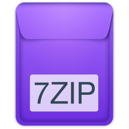</div>

* You have [Homebrew](https://brew.sh) installed. ([Installation](https://mac.install.guide/homebrew/index.html) is outside the scope of this tutorial, but it’s pretty fundamental if you do technical things on your Mac.)

    * This includes installing the [Xcode CLI tools](https://mac.install.guide/homebrew/2.html) (a much smaller download than the _entire_ Xcode).

## Prepare your SD card

I'm starting with a **32 GB SanDisk Ultra MicroSD card, formatted as NTFS**. Nothing fancy, but from a reliable brand. Any kind of MicroSD card should be fine, provided that you feel confident in its reliability.

<div>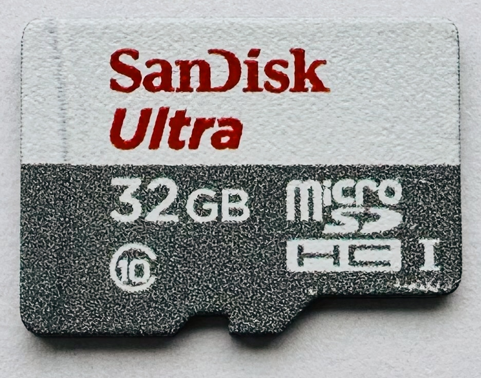</div>

Here's the [Amazon.com (US) link](https://www.amazon.com/dp/B00M55C0NS) (not a referral link). If you want to learn more about which symbols mean which things, [this Wired article](https://www.wired.com/story/sd-card-speeds-explained/) provides a decent explanation.

> [!CAUTION]
> If you ordered a card from Anbernic, it is _probably not_ very reliable. Many people have reported reliability issues with these cards, resulting in data loss. So, heads-up.

1. On your Mac, open _Disk Utility_.

    <div>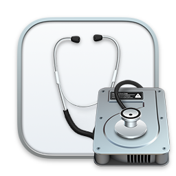</div>

1. On the left (1) _UntitledNTFS_ is the name of my _volume_ (the same as the one that shows up in _Finder_). We want to select its **parent**, which lets us manage the entire SD card. Once we have that selected, we choose _Erase_ from the tool bar (2).

    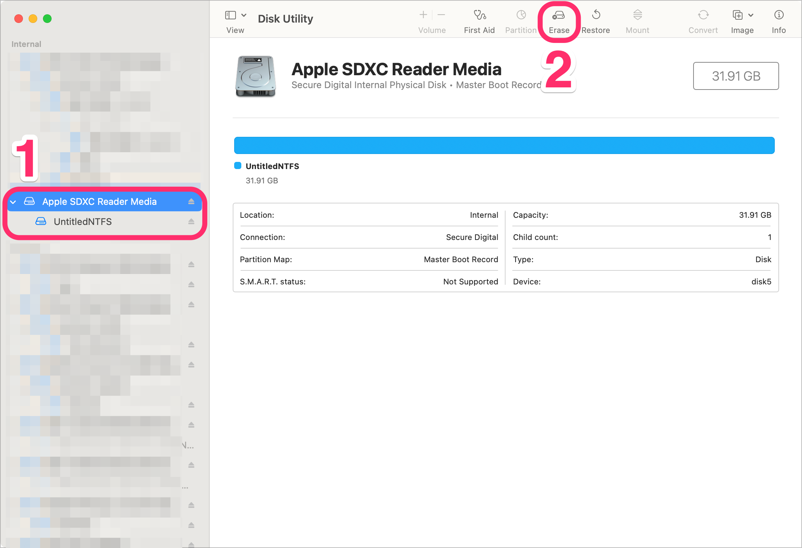

1. After choosing _Erase_, we will be presented with a dialog box. This box contains a few options, and we want to **change** them.

    | Field      | Selection                                                                                                                              |
    |------------|----------------------------------------------------------------------------------------------------------------------------------------|
    | **Name**   | _Untitled_ is fine. We'll be changing this soon anyway.                                                                                |
    | **Format** | Choose _MS-DOS (FAT)_. <br><div></div>       |
    | **Scheme** | Choose _Master Boot Record_. <br><div></div> |

    You should end up with this. If all is well, click the _Erase_ button to begin.

    <div>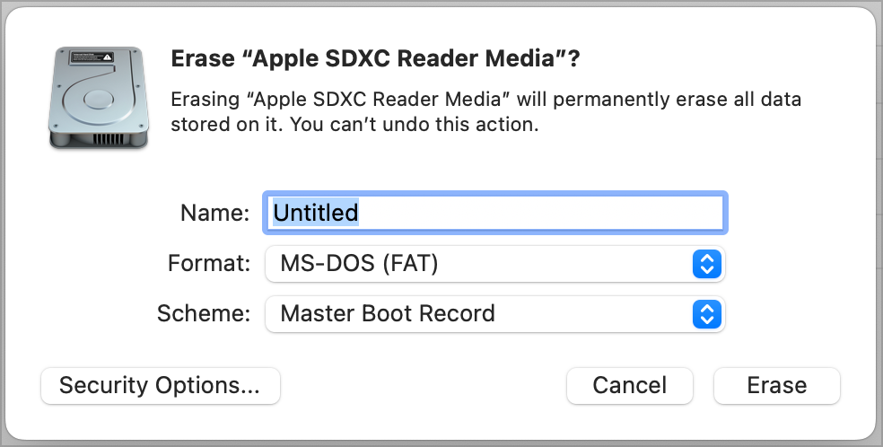</div>

1. _Disk Utility_ will begin reformatting the MicroSD card. When it is done, it should say _Operation successful_. If so, click the _Done_ button.

    <div>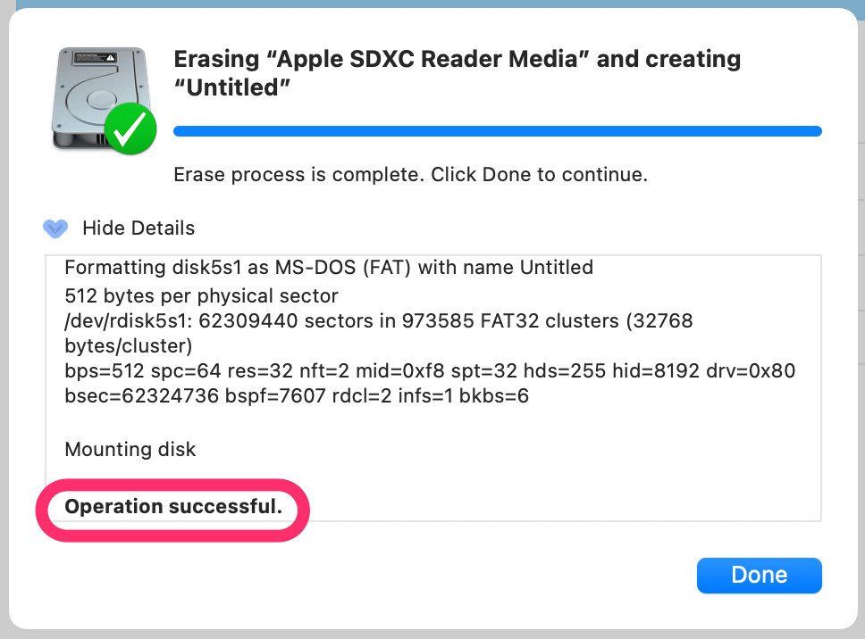</div>

    <details>
    <summary><b>If there was an error…</b></summary><br>

    > **IMPORTANT:** If there was an error, we will need to take additional steps to resolve this. **Take note of the device ID**, which will help us resolve the issue.

    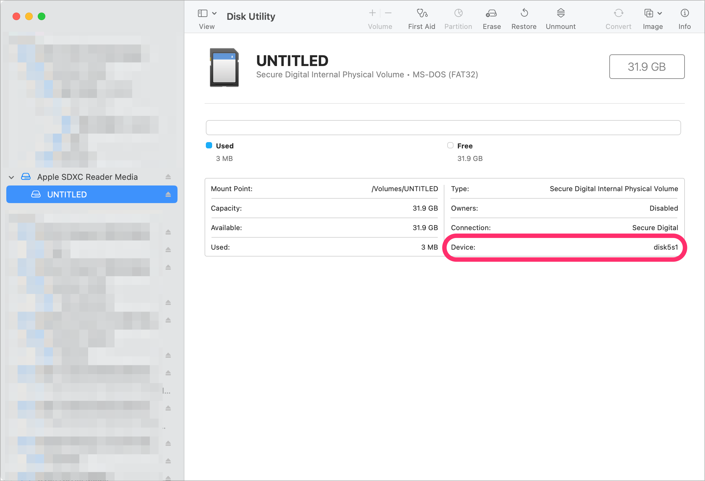

    These are the error messages we know about:

    * [MediaKit reports not enough space on device for requested operation](media-kit-reports-not-enough-space-on-device-for-requested-operation.md)

    </details>

1. **Verify** that the volume is formatted as _MS-DOS (FAT32)_.

    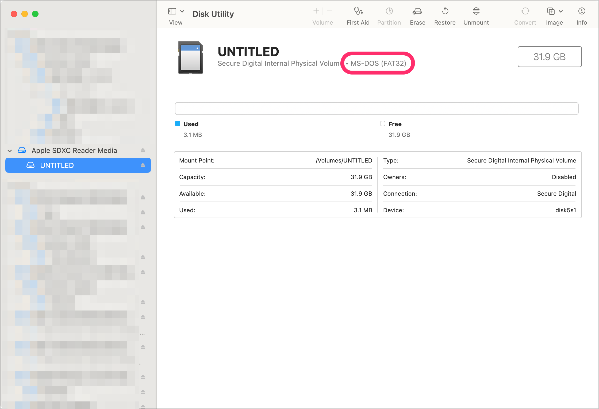

## Downloading Garlic OS

1. Visit <https://www.patreon.com/posts/76561333>

1. Read through the release notes so that you understand what you’re installing.

1. Just above the comment section are the download links. Download both parts.

    * `RG35XX-MicroSDCardImage.7z.001`
    * `RG35XX-MicroSDCardImage.7z.002`

1. Decompress the `.7z` files.

    1. Select _both_ files.

    1. _Right-click_ with a mouse; _two-finger tap_ on a trackpad; or _control-click_ with the keyboard — and then choose _Open_ from the menu.

        (Or if you prefer the keyboard, type _command-down_ (`⌘ ↓`) to open files.)

        

1. This will result in a new directory called `RG35XX-MicroSDCardImage.7z/` with `garlic.img` inside.

## Flashing the microSD card

> [!CAUTION]
> If you have data you care about on the microSD card, back it up before flashing it with Garlic OS.

1. Launch _balenaEtcher_.

    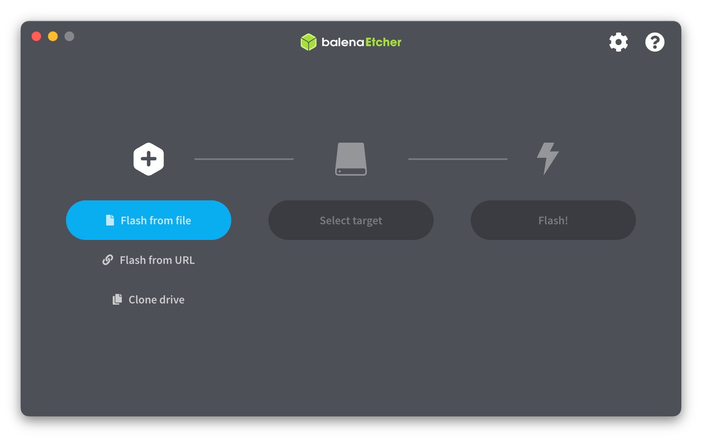

1. Choose _Flash from file_, then find and select the `garlic.img` disk image we downloaded previously.

1. Under _Select target_, choose the device which contains your microSD card. (Take note of the device ID under the _Location_ header.)

    

1. Choose the _Flash!_ button.

    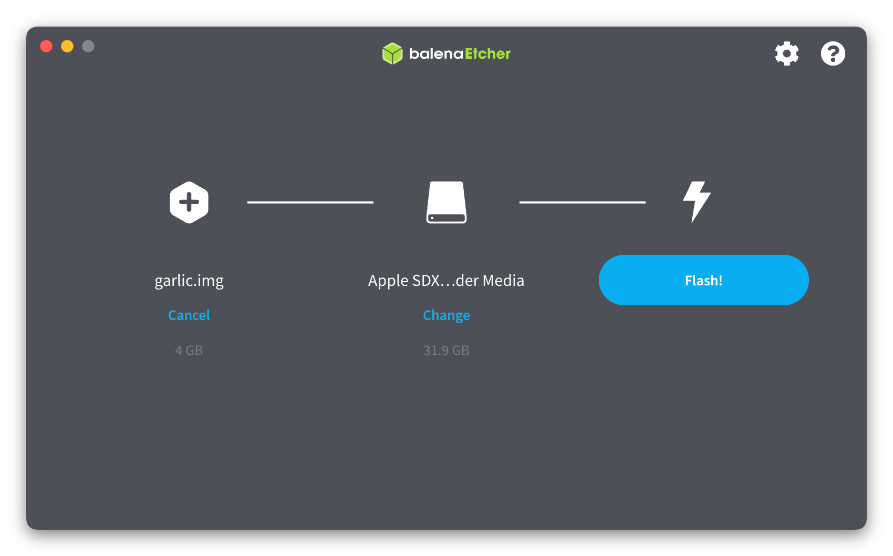

1. Let the flashing process run until it completes.

    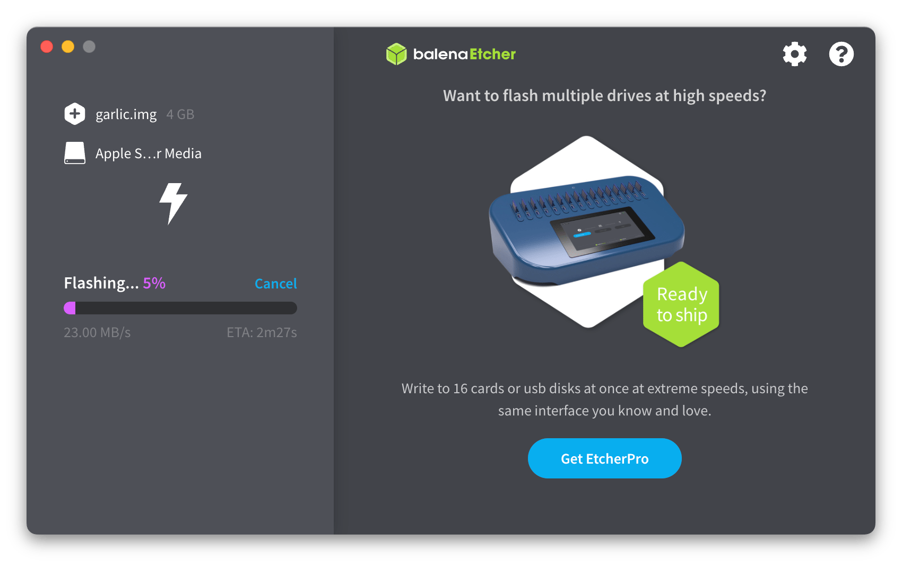

1. Your microSD card volumes will be _unmounted_ after the flashing. Pop your card out, then put it back in so that Finder mounts your new volumes on the desktop.

    If you don’t see the drives on the desktop, check your _Finder settings_ (or _Finder preferences_ in older macOS releases).

    1. Go to Finder (click on the background, click inside a Finder window, etc.).
    1. In the upper-left, find the _Finder_ menu, and choose _Settings…_ (or _Preferences…_ in older macOS releases).
    1. Check to see that _CDs, DVDs, and iPods_ is checked.

        <div></div>

1. If the flashing process named both partitions _No Name_, then rename the larger partition (≈3.38 GB) as _ROMS_ and the smaller partition (≈10.4 MB) as _MISC_. This can be done in Finder the same way as renaming any other file.

    <div></div>

1. Back up the `BIOS/` and `CFW/` folders from the _ROMS_ partition. You will need to restore them after the partition resizing.

## Running gdisk

1. Install `gdisk` using Homebrew.

    ```bash
    brew install --cask gdisk
    ```

1. Use `diskutil` (installed by default on macOS) to view the list of mounted drives and look for the microSD card path. I have _several_ external hard drives, and mine was `/dev/disk11` with 4 partitions.

    > **TIP:** If you paid attention to the _Location_ column in _balenaEtcher_ when you were selecting a disk target, this will be the _same location_.

    ```bash
    diskutil list
    ```

    ```plain
    /dev/disk11 (internal, physical):
    #:                       TYPE NAME                    SIZE       IDENTIFIER
    0:      GUID_partition_scheme                        *31.9 GB    disk11
    1:       Microsoft Basic Data MISC                    10.5 MB    disk11s1
    2:       Microsoft Basic Data                         536.9 MB   disk11s2
    3:       Microsoft Basic Data                         53.5 MB    disk11s3
    4:       Microsoft Basic Data ROMS                    3.4 GB     disk11s4
    ```

1. Launch `gdisk` using `sudo`. You will likely need to enter your password to authenticate.

    > **NOTE:** `sudo` grants administrative permissions to your user, as if to say "super user, do this." If you don’t use `sudo` it will launch, but it will fail on some of the later steps.

    ```bash
    sudo gdisk
    ```

1. `gdisk` will ask for your device ID. We’ve already found this twice. 😉

    ```plain
    GPT fdisk (gdisk) version 1.0.9

    Type device filename, or press <Enter> to exit:
    ```

    My value was `/dev/disk11`. Yours may be different.

    ```plain
    Warning: Devices opened with shared lock will not have their
    partition table automatically reloaded!
    Partition table scan:
    MBR: protective
    BSD: not present
    APM: not present
    GPT: present

    Found valid GPT with protective MBR; using GPT.

    Command (? for help):
    ```

1. Enter the _print_ command to verify we have loaded the right disk.

    ```plain
    p
    ```

    ```plain
    Disk /dev/disk11: 62333952 sectors, 29.7 GiB
    Sector size (logical): 512 bytes
    Disk identifier (GUID): 8F10075C-0512-4DBA-944E-1ADF2C17F4C0
    Partition table holds up to 128 entries
    Main partition table begins at sector 2 and ends at sector 33
    First usable sector is 34, last usable sector is 7812466
    Partitions will be aligned on 2048-sector boundaries
    Total free space is 16350 sectors (8.0 MiB)

    Number  Start (sector)    End (sector)  Size       Code  Name
    1           16384           36863   10.0 MiB    0700  MISC
    2           36864         1085439   512.0 MiB   0700  SYSTEM
    3         1085440         1189887   51.0 MiB    0700  CONFIG
    4         1189888         7812466   3.2 GiB     0700  ROMS

    Command (? for help):
    ```

    Your values may be different. The important bits are these 4 partitions, with these approximate sizes.

1. We need a command that is only available in _expert mode_.

    ```plain
    x
    ```

    ```plain
    Expert command (? for help):
    ```

1. Move backup data structures to end of disk.

    ```plain
    e
    ```

    ```plain
    Relocating backup data structures to the end of the disk

    Expert command (? for help):
    ```

1. Exit _expert mode_ and return to main menu.

    ```plain
    m
    ```

    ```plain
    Command (? for help):
    ```

1. Delete the `ROMS` partition from the GPT table by entering _delete mode_.

    ```plain
    d
    ```

    ```plain
    Partition number (1-4):
    ```

1. For me the `ROMS` partition was 4. Verify yours from the initial print command, but it should also be 4.

    ```plain
    4
    ```

    ```plain
    Command (? for help):
    ```

1. Enter print command again to verify that we have deleted the correct partition.

    > **NOTE:** Remember nothing takes affect until we save and quit, so if there is a mistake, just quit without saving (q) and start again.

    ```plain
    p
    ```

    ```plain
    Disk /dev/disk11: 62333952 sectors, 29.7 GiB
    Sector size (logical): 512 bytes
    Disk identifier (GUID): 8F10075C-0512-4DBA-944E-1ADF2C17F4C0
    Partition table holds up to 128 entries
    Main partition table begins at sector 2 and ends at sector 33
    First usable sector is 34, last usable sector is 62333918
    Partitions will be aligned on 2048-sector boundaries
    Total free space is 61160381 sectors (29.2 GiB)

    Number  Start (sector)    End (sector)  Size       Code  Name
    1           16384           36863   10.0 MiB    0700  MISC
    2           36864         1085439   512.0 MiB   0700  SYSTEM
    3         1085440         1189887   51.0 MiB    0700  CONFIG

    Command (? for help):
    ```

1. Enter _create new partition mode_.

    ```plain
    n
    ```

    ```plain
    Partition number (4-128, default 4):
    ```

1. Choose `4`.

    ```plain
    4
    ```

    ```plain
    First sector (34-62333918, default = 1189888) or {+-}size{KMGTP}:
    ```

1. When it asks you the for first and last sector, press `enter` on both of these to use the default values.

    ```plain
    enter
    ```

    ```plain
    Last sector (1189888-62333918, default = 62332927) or {+-}size{KMGTP}:
    ```

    ```plain
    enter
    ```

    ```plain
    Current type is AF00 (Apple HFS/HFS+)
    Hex code or GUID (L to show codes, Enter = AF00):
    ```

1. For the hex code, choose `0700` for _Microsoft Basic Data_ (as the partition is FAT32).

    ```plain
    0700
    ```

    ```plain
    Changed type of partition to 'Microsoft basic data'

    Command (? for help):
    ```

1. Enter print command again to verify that we have deleted the correct partition.

    > **NOTE:** Remember nothing takes affect until we save and quit, so if there is a mistake, just quit without saving (q) and start again.

    ```plain
    p
    ```

    ```plain
    Disk /dev/disk11: 62333952 sectors, 29.7 GiB
    Sector size (logical): 512 bytes
    Disk identifier (GUID): 8F10075C-0512-4DBA-944E-1ADF2C17F4C0
    Partition table holds up to 128 entries
    Main partition table begins at sector 2 and ends at sector 33
    First usable sector is 34, last usable sector is 62333918
    Partitions will be aligned on 2048-sector boundaries
    Total free space is 17341 sectors (8.5 MiB)

    Number  Start (sector)    End (sector)  Size       Code  Name
    1           16384           36863   10.0 MiB    0700  MISC
    2           36864         1085439   512.0 MiB   0700  SYSTEM
    3         1085440         1189887   51.0 MiB    0700  CONFIG
    4         1189888        62332927   29.2 GiB    0700  Microsoft basic data
    ```

1. Enter _write mode_. This will perform the changes to your disk.

    > **CAUTION:** This is your last chance to quit without breaking anything. Choose `q` if you have noticed a mistake during the print step.

    ```plain
    w
    ```

    ```plain
    Final checks complete. About to write GPT data. THIS WILL OVERWRITE EXISTING
    PARTITIONS!!

    Do you want to proceed? (Y/N):
    ```

    …and confirm!

    ```plain
    Y
    ```

    ```plain
    OK; writing new GUID partition table (GPT) to /dev/disk11.
    Warning: Devices opened with shared lock will not have their
    partition table automatically reloaded!
    Warning: The kernel may continue to use old or deleted partitions.
    You should reboot or remove the drive.
    The operation has completed successfully.
    ```

1. Eject the mounted volumes. You can either:

    1. Select them and drag them to the trash can, or…

    1. _Right-click_ with a mouse; _two-finger tap_ on a trackpad; or _control-click_ with the keyboard — and then choose _Eject_ from the menu.

1. Pop your card out, then put it back in so that Finder mounts your new volumes on the desktop.

    > **NOTE:** The size of the `ROMS` volume will still be incorrect until the next step.

## Cleaning up and restoring backups

1. Open _Disk Utility_ (installed by default on macOS), and find the ROMS partition.

    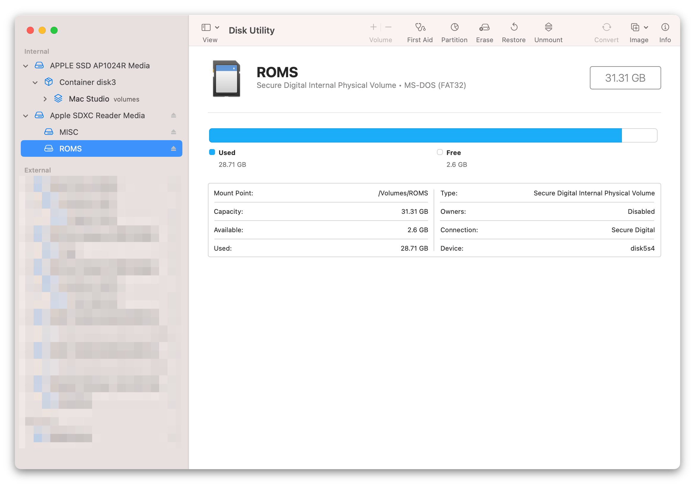

1. Erase the partition. For the name, keep `ROMS`. For the format, choose _MS-DOS (FAT)_.

    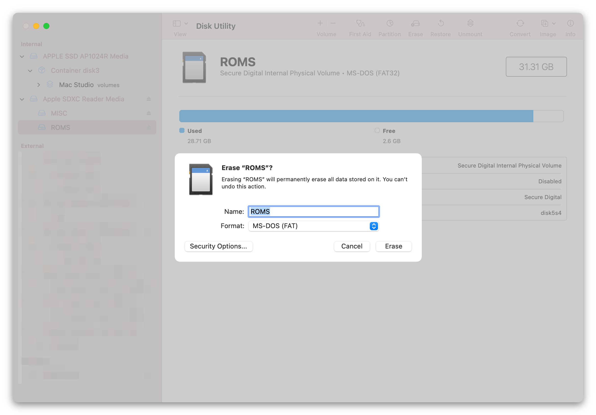

1. Wait for it to complete.

    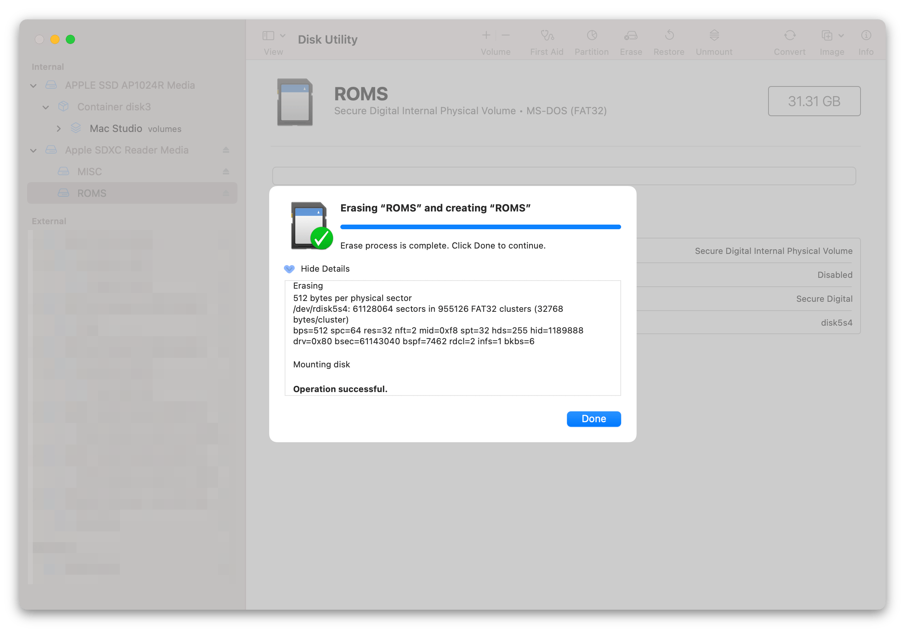

1. Finally re-copy the `BIOS/` and `CFW/` folders we backed-up earlier, and any ROM files and/or save files that you want to make available to your device.

    <div></div>

## Congratulations!

You have installed Garlic OS to your Anbernic RG35XX!

Put the microSD card back into the top slot, and power-on the device.

For more fun, check out [custom themes/skins](https://www.rg35xx.com/temas-garlicos/), as well as [creating a custom boot screen](https://www.reddit.com/r/RG35XX/comments/1177ibw/what_am_i_missing_for_creating_custom_boot_logos/)!

[Alfred]: https://www.alfredapp.com
[Launchbar]: https://www.obdev.at/products/launchbar/
[Raycast]: https://www.raycast.com
[Spotlight]: https://support.apple.com/guide/mac-help/search-with-spotlight-mchlp1008/mac
