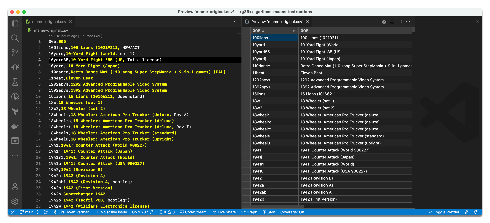
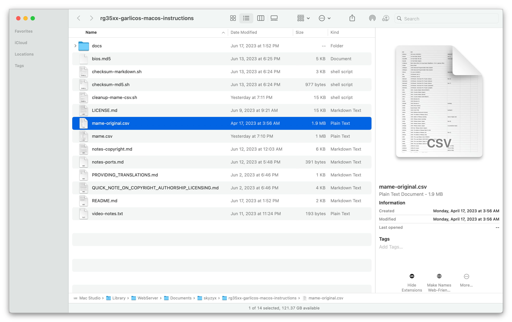

# Cleaning up mame.csv for Garlic OS on your Anbernic RG35XX using macOS

Garlic OS comes with a file called `mame.csv` which is used for mapping the ROM name (e.g., `cvs2mf.zip`) back to its proper name (e.g., _Capcom Vs. SNK 2: Millionaire Fighting 2001 (Japan, Rev A) (GDL-0007A)_). It's essentially used as a _lookup table_.

The CSV format stands for _Comma-Separated Value_ and is one of the simplest formats that has ever existed. First is the name of the ROM file, then a comma, then the proper name of the game. It's seriously that simple.

Most computers will typically open CSV files in a speadsheet program (since a CSV is conceptually a set of rows and columns) like [Microsoft Excel], [Apple Numbers], [LibreOffice Calc], or even [Google Sheets]. However it's important that you save changes back as CSV format, and not the spreadsheet's preferred/native format.

You can also open a CSV in any editor that can read plain text files. (If you don’t have a preferred code editor, I can suggest [VS Code].)



## Getting `mame.csv`

Garlic OS ships with a 1.1 MB copy of `mame.csv`, so MAME (and other arcade) emulation has useful names out-of-the-box.

But we can do better.

A project called `tiny-best-set-go` provides a more complete, 1.9 MB copy of `mame.csv`.



Since there is copyrighted content on this page, I don't want to link to it directly. However one `.zip` file that this project provides is called `tiny-best-set-go-arcade-names-garlic.zip`. Inside of this, you will find a `mame.csv` file.

That file is here: [`mame-original.csv`](../mame-original.csv).

If you prefer longer, and more thorough names, then this is all you need. You can skip ahead to _“Updating `mame.csv` on your Garlic OS SD card”_ below.

However, if you prefer shorter names without all of the extra details, read on.

## Cleaning up `mame.csv`

TLDR: Here is the already-cleaned version: [`mame.csv`](../mame.csv).

You can always edit the file by hand. There's nothing wrong with that, but if there's ever a new version, you'll need to re-apply the changes manually. :/

If you want to _learn how_ to perform the clean-up, read the source code for [`cleanup-mame-csv.sh`](../cleanup-mame-csv.sh). _Understanding_ the code requires knowledge of Bash, GNU `sed`, and Perl-compatible regular expressions (PCRE). There isn't a good way around that, but essentially, we're asking a script to identify _matching patterns_, and then replacing those matches.

Whenever there is a new update to an original `mame.csv` file, this script can be re-run over the updated file, and the same cleanup rules will be applied.

> **NOTE:** If there's something I missed, or you think that I lost the _meaning_ in my changes, please [open an issue](https://github.com/skyzyx/rg35xx-garlicos-macos-instructions/issues/new) describing the issue, and I'll take a look at it.

## Updating `mame.csv` on your Garlic OS SD card

Inside the `ROMS` volume of your SD card, find the `CFW` → `config` folder, then replace `mame.csv` with your updated copy.

<details>
<summary>See the Terminal command…</summary><br>

Open the Finder window:

```bash
open /Volumes/ROMS/CFW/config/
```

You can then copy your new/edited `mame.csv` file _over_ the one that's on the SD card.

Alternatively, if you open a Terminal window and `cd` into the directory where your new/edited `mame.csv` file lives, you can run the following command to perform the copy/replacement.

```bash
cp -vf ./mame.csv /Volumes/ROMS/CFW/config/mame.csv
```

</details>

[Apple Numbers]: https://www.apple.com/numbers/
[Google Sheets]: https://www.google.com/sheets/about/
[LibreOffice Calc]: https://www.libreoffice.org/discover/calc/
[Microsoft Excel]: https://microsoft.com/office/excel
[VS Code]: https://code.visualstudio.com
