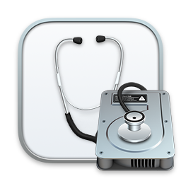
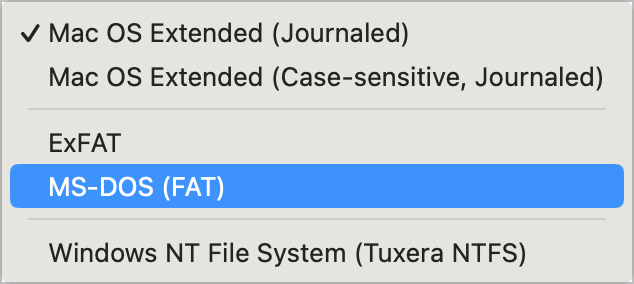
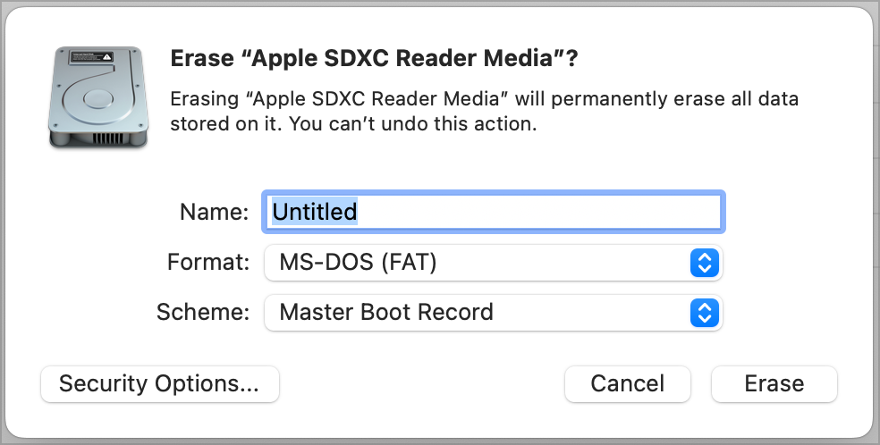
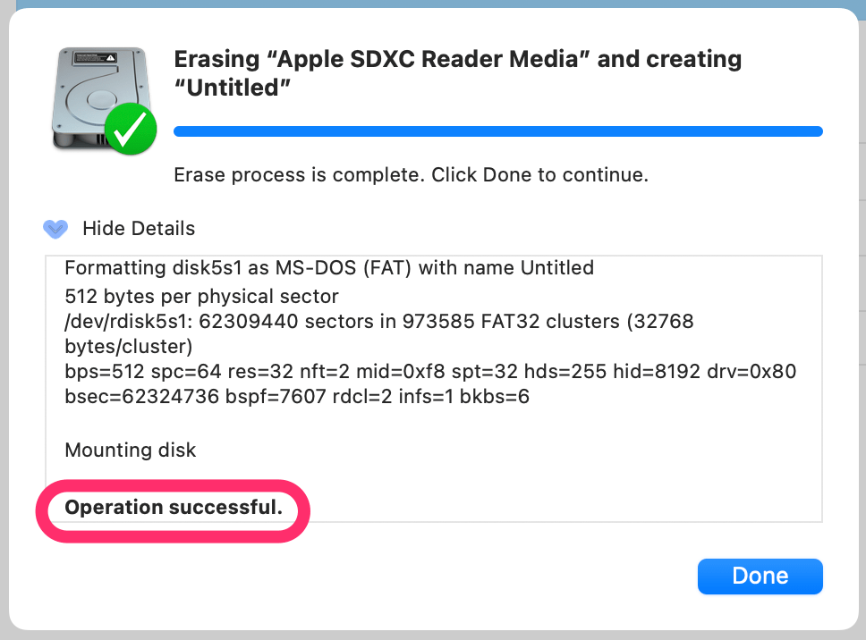

# MediaKit reports not enough space on device for requested operation

> [!CAUTION]
> **ONLY** follow these instructions if you received this error message when using Disk Utility in a previous step. You have _already_ been warned that this will wipe-out data on the MicroSD card.

Searching the web for this error message text turned up some useful results. This error tends to popup when converting a volume from NTFS → APFS, or when the partition mapping needs to be re-done.

* [Ask Different: MediaKit reports not enough space on device for requested operation](https://apple.stackexchange.com/questions/317048/mediakit-reports-not-enough-space-on-device-for-requested-operation)
* [Appuals: Fix: Mediakit Reports Not Enough Space on Device for Requested Operation](https://appuals.com/fix-mediakit-reports-not-enough-space-on-device-for-requested-operation/)
* [Super User: How can I resolve the error "MediaKit reports partition (map) too small"?](https://superuser.com/questions/233531/how-can-i-resolve-the-error-mediakit-reports-partition-map-too-small)

> [!NOTE]
> This error has _nothing to do_ with the RG35XX or this formatting process. Rather this is the result of how the card was formatted previously and macOS’s ability to work with it.

1. Open _Terminal.app_ (or your preferred terminal app).

    <div></div>

1. Using the built-in `diskutil` command, view the list of drives.

    ```bash
    diskutil list
    ```

    <details>
    <summary>View help for diskutil…</summary><br>

    To view help for `diskutil`, run the command by itself.

    ```bash
    diskutil
    ```

    </details>

1. Take the _Device ID_ that we found when we ran into the error, and look for it in this output. Mine was `disk5s1` (yours may be different, so change the value as appropriate), so I'm going to look for `/dev/disk5` in this list.

    > **TIP:** Each _device_ can have zero or more _volumes_. In `disk5s1`, `disk5` is the _device_, and `s1` is the name of the _volume_.

    ```text
    /dev/disk5 (internal, physical):
    #:                       TYPE NAME                    SIZE       IDENTIFIER
    0:     FDisk_partition_scheme                        *31.9 GB    disk5
    1:                 DOS_FAT_32 UNTITLED                31.9 GB    disk5s1
    ```

1. Unmount the device volumes. In my case that is `/dev/disk5` (yours may be different, so change the value as appropriate).

    ```bash
    diskutil unmountDisk /dev/disk5
    ```

    **If that does not work**, use `force`.

    ```bash
    diskutil unmountDisk force /dev/disk5
    ```

    <details>
    <summary>View help for diskutil unmountDisk…</summary><br>

    To view help for `diskutil unmountDisk`, run the command by itself.

    ```bash
    diskutil unmountDisk
    ```

    </details>

1. Next, we're going to write zeroes to the boot sector of the drive, which should wipe-out any faulty partition data, allowing us to re-partition the card. In my case that is `/dev/disk5` (yours may be different, so change the value as appropriate).

    * We're going to use a command called `dd` which is short for _Data Duplicator_. (It might also stand for _Disk Destroyer_ if you have typos in your command — _so be careful_.)

    * We're going to be calling `sudo` (meaning "Hey Super-user, do…"). This will require you to authorize the command using your login password since it needs to perform a low-level, highly-powerful action.

    * There are certain cases where it's possible to have multiple versions of `dd` installed. We're going to _very specifically_ invoke the one installed at `/bin/dd`.

    ```bash
    sudo /bin/dd if=/dev/zero of=/dev/disk5 bs=1024 count=1024
    ```

    > **TIP:** See <https://ss64.com/mac/dd.html> if you want to learn more about this command and these options.

    Output should look something like this:

    ```text
    1024+0 records in
    1024+0 records out
    1048576 bytes transferred in 0.164488 secs (6374787 bytes/sec)
    ```

1. **Physically** remove the MicroSD card from your computer, then put it back in.

1. macOS won't be able to read the card because we just zeroed out the boot sector, removing all partitions and volumes.

    <div></div>

    When this dialog is shown, choose _Initialize…_ to open Disk Utility.

    <div></div>

1. On the left (1) select the device. (Mine is a SD card reader built-in to my Mac called _Apple SDXC Reader Media_. Yours may be different). Once we have that selected, we choose _Erase_ from the tool bar (2).

    

1. After choosing _Erase_, we will be presented with a dialog box. This box contains a few options, and we want to **change** them.

    | Field      | Selection                                                                                                                              |
    |------------|----------------------------------------------------------------------------------------------------------------------------------------|
    | **Name**   | _Untitled_ is fine. We'll be changing this soon anyway.                                                                                |
    | **Format** | Choose _MS-DOS (FAT)_. <br><div></div>       |
    | **Scheme** | Choose _Master Boot Record_. <br><div></div> |

    You should end up with this. If all is well, click the _Erase_ button to begin.

    <div></div>

1. _Disk Utility_ will begin reformatting the MicroSD card. When it is done, it should say _Operation successful_. If so, click the _Done_ button.

    <div></div>
