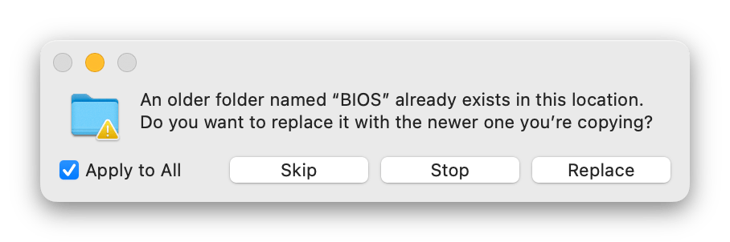
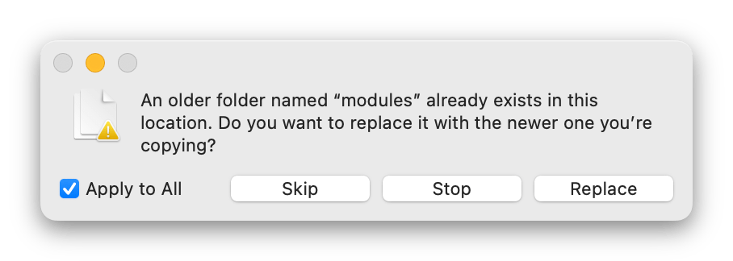

# Updating Garlic OS on your Anbernic RG35XX using macOS

Instructions for updating Garlic OS on your Anbernic RG35XX using macOS.

Each step is explained in English with the corresponding terminal command below it. These instructions should work without problem on any modern macOS — with either Intel or Apple Silicon CPUs. Tested on macOS Ventura 13.3 on both an Intel i9 chip, and an Apple M1 Max chip.

## Prerequisites

* A _relatively_ [recent version of macOS](https://gist.github.com/skyzyx/225b59847be31b39d3d19c3a1c006862).

    

* An application which can open `.7z` archives. I can recommend:

    * [The Unarchiver](https://apps.apple.com/us/app/the-unarchiver/id425424353?mt=12) (free)
    * [Archiver](https://archiverapp.com) (paid)

## Backing-up the existing OS

If you followed one of the _Installing Garlic OS on your Anbernic RG35XX using macOS_ guides to do an initial installation of Garlic OS, you’ll remember that we had a volume called `MISC` and another called `ROMS`.

1. In the `ROMS` volume, you should have (at least) these folders: `BIOS`, `CFW`, `Roms`, `Saves`, and `Screenshots`.

    1. Backup the `BIOS` and `CFW` folders to someplace safe.

    1. (Optional) Backup `Roms`, `Saves`, and `Screenshots` to someplace safe as well.

1. In the `MISC` volume, you’ll have several files all related to Garlic OS.

    1. (Optional) If you have a custom boot logo, make sure you have a backup of `boot_logo.bmp.gz` (from your `MISC` volume), as it will get overwritten by this process.

## Downloading Garlic OS update

1. Visit <https://www.patreon.com/posts/76561333>

1. Read through the release notes so that you understand what you’re installing.

1. Just above the comment section are the download links. Download both parts.

    * `RG35XX-CopyPasteOnTopOfStock.7z.001`
    * `RG35XX-CopyPasteOnTopOfStock.7z.002`

1. Decompress the `.7z` files.

    1. macOS can open `.7z` files natively.

    1. Select _both_ files.

    1. _Right-click_ with a mouse; _two-finger tap_ on a trackpad; or _control-click_ with the keyboard — and then choose _Open_ from the menu.

        (Or if you prefer the keyboard, type _command-down_ (`⌘ ↓`) to open files.)

        

1. This will result in a new directory called `RG35XX-CopyPasteOnTopOfStock.7z/` with `README.txt` and a couple of folders inside.

## Updating the OS

With your microSD card(s) in your computer, we’ll have a `MISC` volume, a `ROMS` volume, and then your downloaded `RG35XX-CopyPasteOnTopOfStock.7z/` folder with a `misc` folder and a `roms` folder. I will refer to these last two by their directory names, `RG35XX-CopyPasteOnTopOfStock.7z/misc/` and `RG35XX-CopyPasteOnTopOfStock.7z/roms/`.

1. Doing `ROMS` first, open the Finder window for `RG35XX-CopyPasteOnTopOfStock.7z/roms/`. Inside you’ll see three directories: `BIOS`, `CFW`, and `Roms`.

    1. Delete this inner `Roms` directory. We don’t need it because all of its subfolders are empty.

    1. Select the `BIOS` and `CFW` folders from inside `RG35XX-CopyPasteOnTopOfStock.7z/roms/`, and copy them into your `ROMS` microSD card volume.

    1. Finder will ask if you want to replace the folders that are there. Choose _Replace_.

        

1. Doing `MISC` second, open the Finder window for `RG35XX-CopyPasteOnTopOfStock.7z/misc/`. Inside you’ll see several files, and we will copy all of them over. **But wait!**

    1. Copying the files straight over to your microSD card will complain that there isn’t enough space. Instead:

        1. Open the Finder window for your `MISC` microSD card volume.

        1. Find and delete the file called `uImage`. Don’t forget to empty the trash.

    1. _Then_ select all of the files and folders from inside `RG35XX-CopyPasteOnTopOfStock.7z/misc/`, and drag them into the `MISC` microSD card volume.

    1. Finder will ask if you want to replace the folders that are there. Choose _Replace_.

        

1. (Optional) If you had a custom boot logo, copy `boot_logo.bmp.gz` from your backup to the root of the `MISC` microSD card volume.

1. (Optional) If you had a custom skin/theme, copy `CFW/skin/` from your backup to the `CFW/skin/` directory on your `ROMS` microSD card volume.

## Congratulations!

You have updated Garlic OS on your Anbernic RG35XX!

Put the microSD card back into the top slot, and power-on the device.

For more fun, check out [custom themes/skins](https://www.rg35xx.com/temas-garlicos/), as well as [creating a custom boot screen](https://www.reddit.com/r/RG35XX/comments/1177ibw/what_am_i_missing_for_creating_custom_boot_logos/)!
